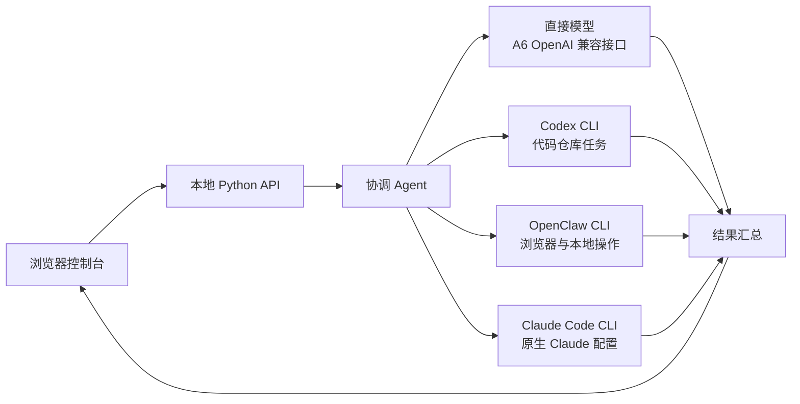

# Orbit Swarm

Orbit Swarm 是一个运行在本机的 Agent 集群控制台，提供类似 Kimi Agent 集群的任务编排体验：一个协调 Agent 负责拆解任务，多个专业 Agent 并行工作，协调 Agent 最后合并结果。项目使用原生 HTML/CSS/JavaScript 和 Python 实现，适合个人电脑上的原型验证、工作流实验和二次开发。

> 本项目是独立实现，与 Kimi、OpenAI、Codex 或 OpenClaw 没有官方关联。

## 文档导航

如果你第一次接触 Orbit Swarm，建议按下面顺序阅读：

1. 本文件：了解项目目标、安装方式和最短上手路径。
2. [`backend/README.md`](backend/README.md)：了解 Python 服务、集群生命周期、Provider、执行器、持久化和 API。
3. [`frontend/README.md`](frontend/README.md)：了解浏览器界面、唯一输入框、设置面板、事件过滤和前端调试。
4. [`docs/README.md`](docs/README.md)：查看架构图、模式/岗位矩阵、数据流、接口示例、运维和贡献指南。

GitHub 仓库建议把 `work/`、真实配置和运行状态排除在提交之外；它们属于本地运行产物，而不是项目源码。

## 功能概览

- 三栏控制台界面：任务列表、协调图、运行时检查器
- 四种运行模式：单 Agent、5 槽、20 槽和 100 槽动态集群
- 岗位级 Provider / 模型 / 执行器路由，可在设置面板新增接口并为每个岗位换模
- 每个模式可从既有岗位目录增删岗位并调整最大槽位数
- 每个 Agent 槽位有稳定名称，状态面板显示岗位、名称、Provider、模型和执行器
- 高 / 中 / 低三档模型映射
- 支持直接模型、Codex、OpenClaw 和 Claude Code 四种执行器
- 主聊天隐藏基础派发与心跳过程，关键状态、异常、裁决和岗位结果仍实时可见
- 实时事件、任务状态、最终汇总
- 暂停、继续、取消和重试
- 支持通过输入框加号附加文本、代码和文件元数据
- 中文 / English 界面切换，并记住上次选择
- 默认模拟执行，不会因为首次启动而产生 API 费用
- 可选 OpenAI 兼容接口，支持用户自己的 A6 API 模型
- 自动读取本机 OpenClaw Provider；MODE 0 默认使用 `codekey/claude-opus-5`
- 任务、事件、岗位会话与配置快照持久化，并支持日志检索及 JSON / Markdown 导出

## 界面和架构



一次任务的默认流程如下：

1. 在输入框提交目标。
2. 协调 Agent 评估复杂度并生成任务图。
3. 系统按当前模式和用户保存的岗位清单启动可用槽位。
4. 每个岗位按自己的 Provider、模型和执行器运行。
5. 协调 Agent 汇总结果，页面显示事件流和最终结果。

## 快速开始

### 选择启动方式

Orbit Swarm 不要求前端构建工具。首次体验建议使用标准库服务，它只需要 Python 3.11+，默认使用模拟模式，不会调用线上模型。需要 FastAPI WebSocket 或准备进行后端扩展时，再安装可选依赖。

### 方式一：Windows 一键启动

双击项目根目录的 `start.cmd`，然后打开：

<http://127.0.0.1:8000>

### 方式二：命令行启动（零依赖）

项目的标准库服务不需要安装第三方 Python 包：

```powershell
git clone <your-repository-url>
cd <repository-directory>
python backend/server_stdlib.py --port 8000
```

然后访问 <http://127.0.0.1:8000>。

如果 `python` 命令不可用，请先安装 Python 3.11 或更高版本，并确认 Python 已加入 PATH。

### 方式三：可选 FastAPI 服务

如果需要使用 FastAPI / Uvicorn 版本：

```powershell
cd backend
python -m venv .venv
.\.venv\Scripts\Activate.ps1
python -m pip install -r requirements.txt
uvicorn main:app --host 127.0.0.1 --port 8000
```

然后访问 <http://127.0.0.1:8000>。标准库服务和 FastAPI 服务实现同一组主要 API，二选一即可，不要同时占用同一个端口。

## 第一个任务

1. 打开控制台，确认顶部显示 `Local`。
2. 在输入框输入一个明确的目标，例如：`分析这个项目的目录结构，并给出重构建议`。
3. 确认 `Agent cluster` 开关处于开启状态。
4. 如需附件，点击输入框左下角的 `+`，选择文件并确认文件标签已经出现。
5. 点击发送按钮，或按 `Ctrl+Enter`（macOS 为 `Cmd+Enter`）直接发送。
6. 在协调图中观察协调 Agent 和 4 个子 Agent 的状态变化。
7. 任务结束后，在 `Final synthesis` 区域查看汇总结果。
8. 已完成的任务可以点击 `Retry` 重新运行；运行中的任务可以暂停或继续。

右上角语言选择框支持 `中文` 和 `English`。选择会保存在浏览器的 `localStorage` 中，不会写入服务器。

## 模型配置

默认模型档位如下：

| 档位 | 默认模型 | 用途 |
| --- | --- | --- |
| High | `gpt-5.6-sol` | 协调和最终汇总 |
| Medium | `gpt-5.6-terra` | 大多数并行分析任务 |
| Low | `gpt-5.6-luna` | 轻量整理和方案草拟 |

模型名称可以通过环境变量覆盖。下面是 PowerShell 示例：

```powershell
$env:A6_OPENAI_BASE_URL = "https://your-a6api-host/v1"
$env:A6_OPENAI_API_KEY = "replace-with-your-key"
$env:A6_PROVIDER_NAME = "a6api"
$env:A6_MODEL_HIGH = "gpt-5.6-sol"
$env:A6_MODEL_MEDIUM = "gpt-5.6-terra"
$env:A6_MODEL_LOW = "gpt-5.6-luna"
$env:A6_REASONING_HIGH = "high"
$env:A6_REASONING_MEDIUM = "medium"
$env:A6_REASONING_LOW = "low"
$env:SWARM_WEIGHT_LOW = "1"
$env:SWARM_WEIGHT_MEDIUM = "2"
$env:SWARM_WEIGHT_HIGH = "5"
$env:SWARM_MAX_WEIGHT = "30"
$env:SWARM_SIMULATION = "true"
python backend/server_stdlib.py --port 8000
```

`backend/.env.example` 是变量清单和模板。当前零依赖启动器不会自动解析 `.env` 文件；使用 `.env` 时，请通过 PowerShell、系统环境变量或进程管理器加载它。不要把真实 API key 提交到 GitHub。

### 在界面中配置

启动后点击右上角的齿轮按钮即可打开运行配置：

1. 在 Provider 目录新增或编辑接口地址、协议、模型列表和密钥来源。
2. 选择模式，从既有岗位目录添加或移除岗位，并设置最大槽位数。
3. 为岗位选择 Provider、模型以及直接模型、Codex、OpenClaw 或 Claude Code 执行器。
4. 保存后重建当前集群；在途任务继续使用创建时的配置快照。

也可以直接在唯一输入框中修改，例如：

```text
模式2只保留系统架构师、后端开发组和测试开发组
模式3文档执行组改为5个，使用 OpenClaw
模式1添加观察员2个，模型 DeepSeek V4 Flash，接口 deepseek
模式2移除安全审计员
```

默认策略为：Claude、管理、数据、测试和安全岗位使用直接模型；主要编码岗位使用 Codex；文档、运维和观察岗位使用 OpenClaw。Claude Code 保持手动选择，以免把 OpenAI 兼容接口误当成 Anthropic 原生接口。

API key 输入框留空会保留当前 key。密钥只保存在服务进程内存中，页面和 `/api/config` 只会显示“已配置”和末尾提示。服务重启后，环境变量或 OpenClaw 配置中的值会重新生效。

### 加权并发规则

并发不是简单的 Agent 数量，而是活动 Agent 权重之和：

| 档位 | 默认权重 |
| --- | ---: |
| Low | 1 |
| Medium | 2 |
| High | 5 |

默认总上限是 `30`。例如 3 个 Medium 和 2 个 Low 的活动权重是 `3 × 2 + 2 × 1 = 8`；当新 Agent 会让总权重超过上限时，它会等待已有 Agent 释放权重。每个新任务会锁定创建时的模型、推理强度和档位权重。

## 模拟模式与真实执行

模拟模式默认开启：

```powershell
$env:SWARM_SIMULATION = "true"
```

此模式只运行本地编排和模拟 Agent，不调用线上模型，也不启动 Codex/OpenClaw。

确认配置和费用控制后，才启用真实执行：

```powershell
$env:SWARM_SIMULATION = "false"
python backend/server_stdlib.py --port 8000
```

真实执行时：

- 通用分析任务调用 `A6_OPENAI_BASE_URL + /chat/completions`。
- 代码、仓库、测试等任务在检测到 `codex` 命令时选择 Codex；Codex 使用只读沙箱和临时输出文件。
- 搜索、浏览器和本地自动化任务在检测到 `openclaw` 命令时选择 OpenClaw。
- 如果执行器不可用或接口失败，任务会安全失败，不会把 API key 写入任务结果或 `/api/system` 响应。

执行器检测可通过系统接口查看：

```powershell
Invoke-WebRequest http://127.0.0.1:8000/api/system
```

## OpenClaw 配置复用

程序会读取本机 OpenClaw Provider 目录；当没有显式设置 `A6_OPENAI_BASE_URL` 和 `A6_OPENAI_API_KEY` 时，还会把其中的 `a6api` 作为旧版默认配置：

```text
%USERPROFILE%\.openclaw\openclaw.json
```

结构化注册表会导入 `models.providers` 下的可用接口，包括 `codekey`。项目内置 `https://codekey.ai/v1` 和默认模型 `claude-opus-5`，密钥从 `CODEKEY_API_KEY` 或 OpenClaw 配置读取。也可以显式指定配置文件：

```powershell
$env:OPENCLAW_CONFIG_PATH = "C:\path\to\openclaw.json"
```

密钥只保存在当前 Python 进程内存中，不会复制到项目文件，也不会展示在前端。

## API 速查

| 方法 | 路径 | 说明 |
| --- | --- | --- |
| `GET` | `/api/system` | 查看模型、执行器和模拟模式状态 |
| `GET` | `/api/config` | 获取不含 API key 的当前运行配置 |
| `POST` | `/api/config` | 更新渠道、模型、推理强度和加权并发配置 |
| `GET` / `POST` | `/api/providers` | 查看或新增已脱敏的 Provider 配置 |
| `GET` / `PUT` / `DELETE` | `/api/providers/{id}` | 查看、更新或停用 Provider |
| `POST` | `/api/providers/{id}/test` | 执行元数据检查；显式 `live=true` 才联网 |
| `GET` / `POST` | `/api/routes` | 查看或新增岗位、池、档位路由 |
| `PUT` / `DELETE` | `/api/routes/{scope}/{key}` | 更新或移除指定 Provider / 模型路由 |
| `GET` / `POST` / `PUT` | `/api/agent-profiles` | 查看或保存各模式的岗位清单、槽位、模型和执行器 |
| `POST` | `/api/agent-profiles/command` | 提交结构化岗位配置命令；自然语言也可直接发到任务输入框 |
| `GET` | `/api/tasks` | 获取任务列表 |
| `POST` | `/api/tasks` | 创建任务 |
| `GET` | `/api/tasks/{id}` | 获取任务详情 |
| `POST` | `/api/tasks/{id}/control` | 执行 `pause`、`resume`、`cancel` 或 `retry` |
| `WS` | `/ws/tasks/{id}` | 订阅任务快照（FastAPI 版本） |

创建任务示例：

```powershell
$body = @{ prompt = "比较两个实现方案并给出建议"; cluster_enabled = $true; workspace = $false } | ConvertTo-Json
Invoke-WebRequest http://127.0.0.1:8000/api/tasks -Method Post -ContentType "application/json" -Body $body
```

## 目录结构

```text
.
├── backend/
│   ├── server_stdlib.py   # 零依赖启动入口
│   ├── main.py            # 可选 FastAPI 入口
│   ├── executors.py       # 模型和执行器路由
│   ├── providers.py       # Provider 注册表与路由快照
│   ├── routing_api.py     # 两种服务共用的配置契约
│   ├── agent_profile_commands.py # 唯一输入框的岗位配置解析
│   ├── cluster.py         # 模式、岗位、命名、心跳与争议处理
│   ├── .env.example       # 配置模板
│   └── requirements.txt
├── frontend/
│   ├── index.html          # 页面结构
│   ├── app.js              # 状态、事件和语言切换
│   ├── styles.css          # 界面样式
│   └── README.md           # 前端使用与开发说明
├── docs/
│   └── README.md           # 架构、接口、运维和贡献索引
├── start.cmd               # Windows 启动脚本
└── README.md
```

后端目录中的每个模块都保持单一职责：`cluster.py` 负责集群状态和协作，`providers.py` 负责 Provider/路由注册表，`executors.py` 负责模型与 CLI 执行器，`storage.py` 负责脱敏持久化，`exports.py` 负责导出，`routing_api.py` 负责两种服务入口共用的配置契约。详细关系见 [`docs/README.md`](docs/README.md)。

## 当前限制

- 任务、事件和非敏感配置会持久化；API 密钥仍只来自内存、环境变量或本机 OpenClaw 配置。
- 默认没有用户认证、权限管理或远程访问保护，只建议绑定本机地址使用。
- 标准库版本使用轮询回退；FastAPI 版本提供 WebSocket 任务流。
- 各模式保留岗位最大槽位并按可用 Provider 弹性激活；加权并发限制会跨任务控制真正进入执行器的 Agent。
- 真实执行器是可选适配层，生产环境还应补充审批、日志脱敏、工作目录策略、超时和费用上限。

## 安全建议

- 不要把 API key、OpenClaw 配置文件或 `.env` 提交到 GitHub。
- 首次运行保持 `SWARM_SIMULATION=true`。
- 启用真实执行前，先使用低风险任务验证模型、Codex 和 OpenClaw 的权限范围。
- 不要把服务端口暴露到公网；如必须远程访问，请在前面增加认证和 HTTPS。

## 开发与验证

```powershell
node --check frontend/app.js
python -m py_compile backend/server_stdlib.py backend/executors.py backend/main.py
```

启动服务后，建议至少验证：创建任务、并行 Agent 完成、暂停 / 继续、重试、语言切换和 `/api/system`。

## 许可证

如果准备公开发布，请在此处补充你选择的许可证，例如 MIT、Apache-2.0 或 GPL-3.0。
