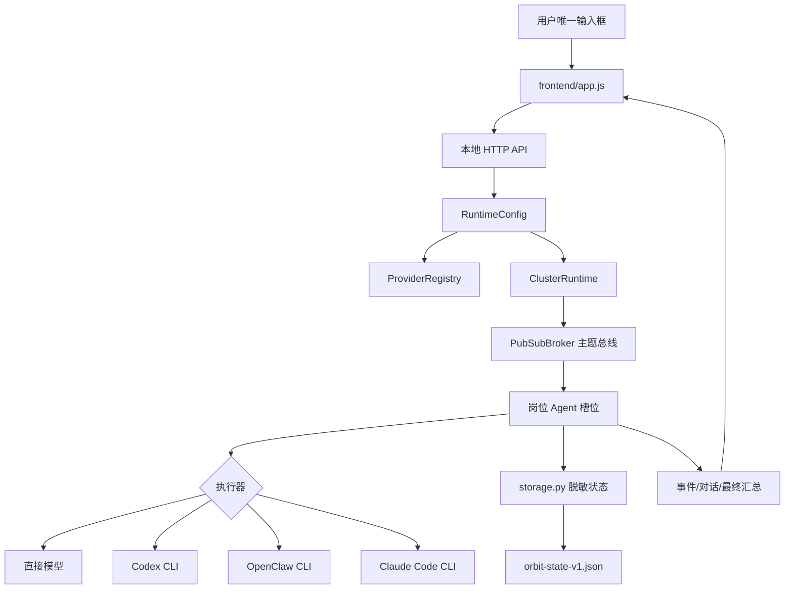

# Orbit Swarm 文档索引

这份文档面向想了解设计、接入模型或准备发布 GitHub 版本的开发者。普通使用者先看根目录 [`README.md`](../README.md)；后端实现看 [`backend/README.md`](../backend/README.md)；浏览器界面看 [`frontend/README.md`](../frontend/README.md)。

## 1. 设计目标

Orbit Swarm 把“一个输入框 + 自动协作”作为唯一用户入口。用户不需要手工选择每个 Agent，也不需要理解内部派发过程；系统根据运行模式、岗位配置和 Provider 可用性完成协作，并把必要的进展、来源和异常反馈给用户。

设计目标可以概括为四点：

1. **岗位可见**：每条对外岗位消息都有来源岗位和 Agent 名称，状态面板还显示 Provider、模型和执行器。
2. **弹性容缺**：岗位只声明最大数量。模型密钥、配额或 CLI 不可用时，对应槽位降级，其他岗位继续工作。
3. **可替换执行**：直接模型、Codex、OpenClaw 和 Claude Code 都是执行器适配层，Provider 和模型路由可以独立替换。
4. **可恢复可检索**：任务结构、事件、岗位会话和配置快照持久化；服务重启后可以继续查看历史，不把密钥写进状态文件或导出文件。

## 2. 总体架构



后端的业务逻辑由标准库服务和 FastAPI 服务共享。两者的区别主要是传输层：标准库服务使用轮询和原生 `http.server`，FastAPI 服务额外提供 WebSocket 任务快照。Provider、集群、存储和导出代码不应在两个入口中各写一份。

## 3. 四种模式和岗位矩阵

岗位目录是固定的可选项；每个模式可以使用目录中的子集，并调整每个岗位的最大数量。下面的模型是岗位契约中的逻辑模型名，真正调用的 Provider/模型 ID 由路由解析得到。

### 模式 0：单 Agent

| 岗位 | 最大数量 | 默认模型 | 默认执行器 |
| --- | ---: | --- | --- |
| 通用助理 | 1 | Claude Opus 5 | 直接模型 |

没有内部辩论或工作池，适合问答、轻量整理和配置验证。正式服务的默认路由会把它解析到 CodeKey 的 `claude-opus-5`；如果没有可用 Provider，系统仍以模拟模式启动。

### 模式 1：中档模式（5 槽位）

| 岗位 | 数量 | 默认模型 | 默认执行器 | 主要职责 |
| --- | ---: | --- | --- | --- |
| 总管理（GM） | 1 | Claude Opus 5 | 直接模型 | 拆解任务、分配工作、一票否决 |
| 全栈开发 | 1 | GPT-5.6 Terra | Codex | 业务逻辑和 API |
| 后端/数据库 | 1 | GPT-5.6 Terra | 直接模型 | 数据设计和 SQL 优化 |
| 测试工程师 | 1 | DeepSeek V4 Flash | 直接模型 | 测试用例和验证 |
| 文档/运维 | 1 | DeepSeek V4 Flash | OpenClaw | 文档和部署脚本 |

### 模式 2：高档模式（20 槽位）

| 岗位 | 最大数量 | 默认模型 | 默认执行器 |
| --- | ---: | --- | --- |
| 系统架构师 | 1 | Claude Opus 5 | 直接模型 |
| 前端 TL / 后端 TL / 数据 TL | 各 1 | GPT-5.6 Sol | 直接模型 |
| 前端开发组 / 后端开发组 | 各 3 | GPT-5.6 Terra | Codex |
| 数据库/缓存组 | 2 | GPT-5.6 Terra | 直接模型 |
| 测试开发组 | 3 | DeepSeek V4 Flash | 直接模型 |
| 安全审计员 | 1 | GPT-5.6 Sol | 直接模型 |
| 文档编写组 | 2 | DeepSeek V4 Flash | OpenClaw |
| 运维实施组 | 1 | DeepSeek V4 Flash | OpenClaw |
| 人力资源（HR） | 1 | GPT-5.6 Luna | 直接模型 |

高档模式发生争议时，由架构师和三位 TL 加权投票，架构师权重更高。

### 模式 3：极限模式（100 槽位）

| 岗位 | 最大数量 | 默认模型 | 默认执行器 |
| --- | ---: | --- | --- |
| 超级网关 | 1 | GPT-5.6 Luna | 直接模型 |
| 辩论主持人 | 1 | Claude Opus 5 | 直接模型 |
| HR | 1 | GPT-5.6 Sol | 直接模型 |
| 观察员 | 2 | DeepSeek V4 Flash | OpenClaw |
| 编码池长 | 1 | Claude Opus 5 | 直接模型 |
| 编码执行组 | 20 | GPT-5.6 Terra | Codex |
| 测试池长 | 1 | GPT-5.6 Sol | 直接模型 |
| 测试执行组 | 15 | DeepSeek V4 Flash | 直接模型 |
| 安全池长 | 1 | GPT-5.6 Sol | 直接模型 |
| 安全执行组 | 10 | GPT-5.6 Sol | 直接模型 |
| 文档池长 | 1 | Claude Opus 5 | OpenClaw |
| 文档执行组 | 10 | DeepSeek V4 Flash | OpenClaw |
| 性能池长 | 1 | GPT-5.6 Terra | 直接模型 |
| 性能执行组 | 5 | GPT-5.6 Terra | 直接模型 |
| 辩论储备组（辩手） | 30 | GPT-5.6 Terra | 直接模型 |

极限模式由辩论主持人随机抽取正反方各 3 名辩手，多轮陈述后让所有激活 Agent 投票；平局由 HR 使用历史完成率裁决。

## 4. Provider、Route 和执行器

### Provider

Provider 描述“如何连接一个模型服务”，包括：

- 稳定 ID 和显示名称。
- `base_url`、协议类型和可用模型列表。
- 密钥环境变量或进程内密钥。
- 可用性、超时、优先级和模拟状态。

内置协议是 OpenAI Chat Completions 和 Anthropic Messages。新增 Provider 不等于立即联网；模拟模式下可先验证路由和界面。

### Route

Route 描述“哪个岗位在什么上下文使用哪个 Provider/模型/执行器”。作用域从宽到窄依次为档位、池、岗位；岗位路由优先级最高。任务创建时解析一次，并把结果写入配置快照，因此修改设置不会改变已经开始的任务。

### 执行器选择

| 执行器 | 连接方式 | 推荐场景 | 不可用时的行为 |
| --- | --- | --- | --- |
| `direct_model` | HTTP Provider | 分析、管理、测试、数据、安全 | 槽位标记未激活或使用模拟结果 |
| `codex` | Codex CLI | 代码、仓库、测试实现 | 检测不到 CLI 时该槽位不启动 |
| `openclaw` | OpenClaw CLI | 搜索、浏览器、本地自动化、文档运维 | 检测不到 CLI 时该槽位不启动 |
| `claude_code` | Claude Code CLI | Anthropic 原生代码工作流 | 非 Anthropic 路由会被拒绝 |

默认策略是编码岗位优先 Codex，文档/运维/观察岗位优先 OpenClaw，管理、数据、测试和安全岗位使用直接模型，Claude Code 保持手动选择。

## 5. 配置优先级

配置来源从部署者最容易覆盖的来源到默认值大致为：

1. `POST /api/config`、Provider/Route CRUD 或设置面板保存的运行时配置。
2. `ORBIT_PROVIDERS_JSON`、`ORBIT_ROUTES_JSON` 和 `ORBIT_MODE` 等环境变量。
3. OpenClaw 的 `models.providers` 注册表和旧版 `a6api` 投影。
4. 内置模式、岗位目录和默认档位模型。

`.env.example` 只是模板，不会被零依赖服务自动读取。GitHub 发布版本应只保留空白模板：

```powershell
Copy-Item backend\.env.example backend\.env
# 编辑 backend\.env，填入自己的 key；不要把 backend\.env 提交到仓库
```

首次运行建议保持：

```text
ORBIT_MODE=0
SWARM_SIMULATION=true
A6_MODEL_HIGH=gpt-5.6-sol
A6_MODEL_MEDIUM=gpt-5.6-terra
A6_MODEL_LOW=gpt-5.6-luna
```

真实执行前再配置 `OPENAI_API_KEY`、`ANTHROPIC_API_KEY`、`DEEPSEEK_API_KEY`、`CODEKEY_API_KEY` 或自定义 Provider 的密钥环境变量。密钥不应写入 JSON 状态、导出文件、截图或 GitHub issue。

## 6. 状态和可恢复性

状态默认保存到 `work/state/orbit-state-v1.json`，主要包含：

- `config` 和按任务固定的 `config_snapshots`。
- 任务标题、阶段、对话、事件、结果和来源岗位。
- `task_attachments` 的文件元数据，而不是任意本地文件内容。
- 版本、保存时间和恢复信息。

`AtomicJsonStateStore` 通过临时文件和替换方式写入；加载失败时会保留坏文件用于排查，并创建干净状态继续服务。`storage.redact_secrets()` 会同时处理结构化密钥字段和文本中的已知密钥值。公开 API 和导出只返回脱敏数据。

## 7. API 使用顺序

推荐集成方按以下顺序调用：

1. `GET /api/system`：确认模式、Provider、执行器和持久化状态。
2. `GET /api/agent-profiles`：读取岗位目录和当前模式配置。
3. （可选）`POST /api/providers`、`PUT /api/routes/...` 或 `PUT /api/agent-profiles`：更新配置。
4. `POST /api/tasks`：创建任务并保存任务级配置快照。
5. `GET /api/tasks/{id}` 或 WebSocket `/ws/tasks/{id}`：读取进度。
6. `GET /api/tasks/{id}/export?format=markdown`：生成可分享报告。

最小任务请求：

```json
{
  "prompt": "分析当前服务的错误处理并给出可执行改进方案",
  "cluster_enabled": true,
  "workspace": false,
  "attachments": []
}
```

岗位配置命令可以直接作为 `prompt` 提交；后端会返回 `configuration_updated=true` 和一条确认任务，不会启动普通任务流水。

## 8. GitHub 发布和部署建议

发布前检查：

- `backend/.env.example` 中所有 key 值为空。
- 仓库中没有 `.env`、`work/`、运行日志、浏览器 profile、截图和 `orbit-state-v1.json`。
- README 中的 URL、命令、端口和当前默认模式与代码一致。
- 以模拟模式启动一次，确认页面、`/api/system`、岗位设置、配置命令和导出可用。
- 真实模型测试使用临时环境变量，不把结果或密钥写回仓库。

生产或多人使用前，还应在反向代理中增加认证、HTTPS、请求大小限制、费用上限、审计和工作目录隔离。当前项目默认只适合本机或受控内网运行。

## 9. 扩展指南

### 新增岗位

在 `cluster.py` 的模式定义和岗位目录中增加稳定 `role_key`、显示名称、最大数量、职责、模型和推荐执行器；为相似岗位使用不同 `role_key`，防止路由覆盖。然后更新前端岗位目录显示和对应测试。

### 新增 Provider 协议

在 `providers.py` 增加协议规范和公开字段，在 `executors.py` 增加请求编码/响应解码，再在两个 HTTP 入口补充校验和错误响应。模拟模式必须能够在没有网络的情况下覆盖该协议。

### 新增存储后端

保留 `build_state_document()`、脱敏和恢复语义，令新实现提供 `load()`、`save()`、`status()` 三个基本能力。任务快照字段应保持兼容，避免更换存储后无法打开旧任务。

### 新增前端页面区域

先定义后端 JSON 契约，再在 `index.html` 加稳定 ID，在 `app.js` 中加入状态合并与渲染，在 `styles.css` 中添加桌面/移动布局。新消息要经过“用户是否真的需要看到”的判断，基础内部协作继续留在日志。

## 10. 验证命令

```powershell
# 后端单元和 HTTP 回归
cd backend
python -m unittest discover -v -p "test_*.py"
python -m py_compile *.py

# 前端语法
cd ..
node --check frontend/app.js

# 标准库服务
python backend/server_stdlib.py --port 8000
```

如果使用 FastAPI，再创建虚拟环境并运行 `uvicorn main:app --host 127.0.0.1 --port 8000`。两个服务实现同一业务契约，不要同时占用端口。
